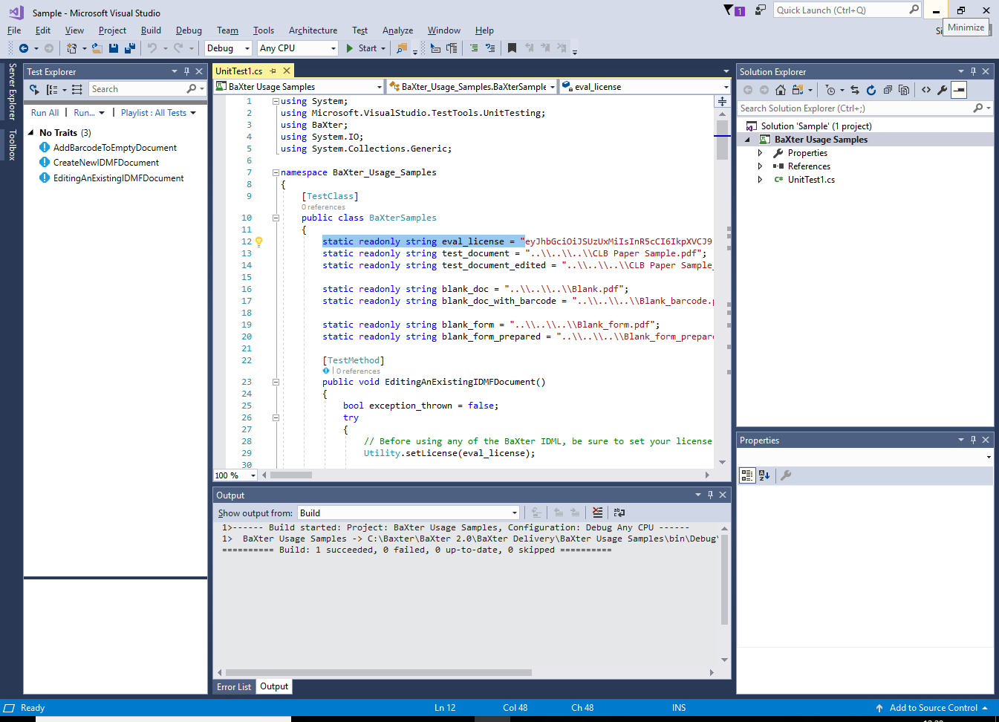

# Getting Started 

## Development Environment

The sample application is supplied for Windows 7 and above to demonstrate using the SDK.


## Download the Wacom Ink SDK for documents

Download the SDK from https://developer.wacom.com/developer-dashboard

* Login using your Wacom ID
* Select **Downloads for documents**
* Download **Wacom Ink SDK for documents for Windows Desktop**
* Accept the End User License Agreement to use the SDK

The downloaded Zip file contains the SDK with documentation.

## Download an Evaluation License

A license is needed to use the SDK and a fully functional evaluation license is free to download as follows:

* Navigate to https://developer.wacom.com/developer-dashboard
* login using your Wacom ID
* Select **Licenses**
* Select **New Evaluation License**
* Select **Generate Evaluation License** for Wacom Ink SDK for documents
* Return to Licenses where the new license file is ready for download
* Download the license file

The license is supplied as a JWT text string in a text file.
This will need to be copied into your application.
The self-service evaluation licenses have a three-month expiry date from the time of creation.
However you can generate a new license at any time. 


----
## Sample Code

The sample C# application is provided to assist with new development.
The sample code is included in unit tests which process PDF documents supplied with the SDK download.

To use the SDK you must first obtain a license, described above.

The following steps describe how to build and run the unit tests:

* Ensure that the .NET Framework 4.6.2 is installed for a successful build.
* Open the sample solution Sample.sln in Visual Studio 2017.
* Open the sample UnitTest1.cs
* Insert your license in the code:
```
    static readonly string eval_license = "your-license-string";
```
* Build the application
* Display the Visual Studio Test Explorer (Test...Windows...Test Explorer)
* Run a test by selecting it for run/debug in the  Test Explorer
      

  

----
----


